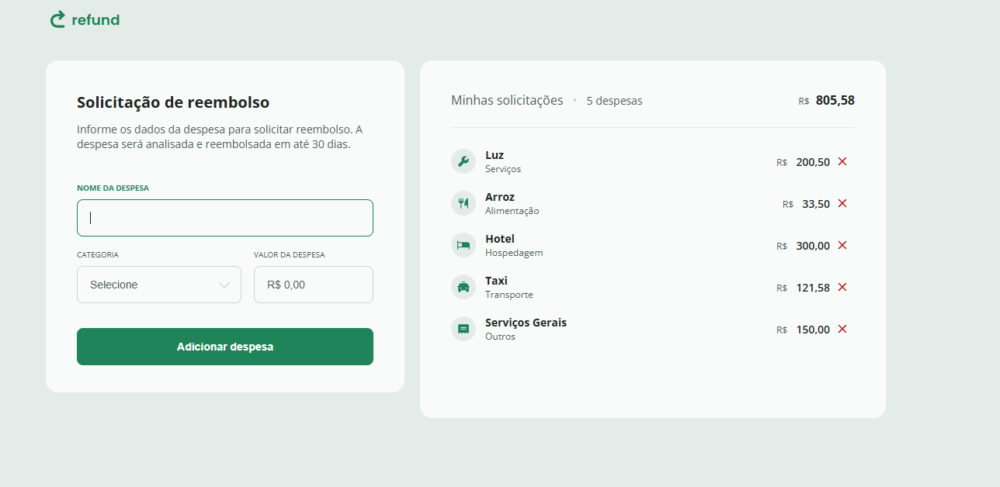
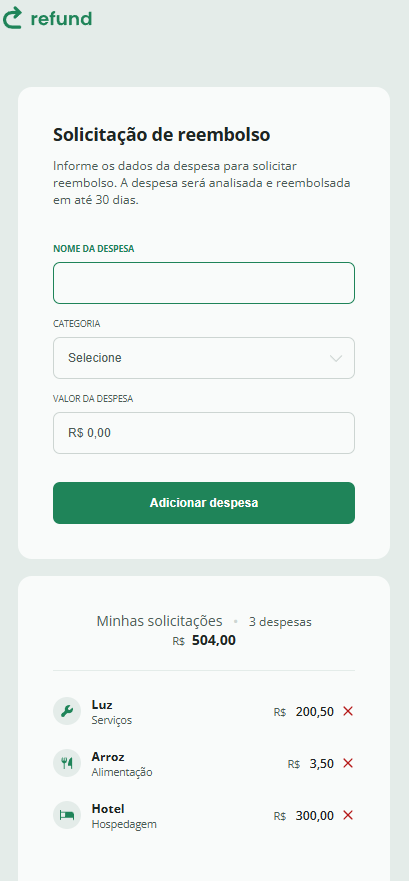

<h1 align="center" style="font-weight: bold;">Refund💻</h1>

 <a href="#tech">Technologies</a> • 
 <a href="#started">Getting Started</a> • 

    <b>
      Service refund page made to practice JavaScript and note down concepts.
    </b>

     <a href="https://thalesfortes.github.io/Refund/">📱 Visit this Project</a>

<h2 id="layout">🎨 Layout Web</h2>

      

<h2 id="layout">🎨 Layout Mobile</h2>

      

<h2 id="tech">💻 Technologies</h2>

- HTML5
- CSS3
- JAVASCRIPT

<h2 id="started">🚀 Getting started</h2>

- Just download the project with its assets and run it with liveserve or just by opening the html document

